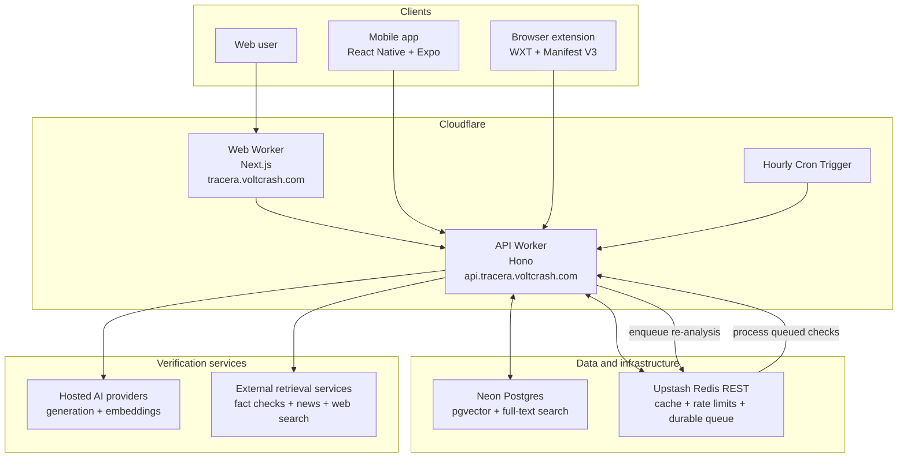

# Tracera

## Purpose

Tracera combats misinformation by evaluating text, links, images, and news sources against reputable evidence. It decomposes a story into atomic claims, traces each claim toward its earliest known source ("Ground Zero"), and reports claim-level verdicts alongside evidence quality and a multi-dimensional Tracera Score.

Tracera also preserves verified claims for deduplication, related-context retrieval, score re-evaluation, and timelines that show how a story's credibility changes as new evidence appears.

## Features

- **Multi-format analysis:** Check news presented as text, links, or images through one verification flow.
- **Claim decomposition:** Break a story into atomic, individually verifiable factual claims instead of judging the article as a whole.
- **Ground Zero tracing:** Identify and surface the earliest known source of a story or claim.
- **Evidence-backed verdicts:** Cross-check each claim against reputable sources and distinguish supporting, conflicting, and inconclusive evidence.
- **Evidence-quality confidence:** Show how strong, recent, and complete the available evidence is separately from the claim verdict.
- **Tracera Score:** Summarize source reputation, factual skew, manipulative language, recency, and cross-source corroboration in a transparent rating.
- **Trace timelines:** Track previous checks, reappearances, and score changes as a story develops.
- **Verified claims corpus:** Reuse prior analysis for deduplication and related context while periodically re-checking claims as evidence changes.

## Stack

- **Monorepo:** Turborepo, pnpm, TypeScript
- **Web:** Next.js
- **Mobile:** React Native, Expo
- **Browser extension:** WXT, Manifest V3
- **API:** Hono
- **Data:** Neon Postgres, pgvector, PostgreSQL full-text search, Drizzle ORM
- **Cache and durable work queue:** Upstash Redis REST
- **Authentication:** Temporarily unavailable during the identity-system migration
- **AI:** Provider-neutral generation and embedding adapters for Gemini, OpenAI, OpenRouter, Anthropic, and OpenAI-compatible APIs

## Current deployment architecture

The Next.js web application and Hono API are deployed as separate Cloudflare Workers. The web Worker serves the product at `tracera.voltcrash.com`, while all web, mobile, and browser-extension clients communicate with the API Worker at `api.tracera.voltcrash.com`.

The API Worker connects to Neon Postgres for application data, full-text search, claim embeddings, and vector retrieval. Upstash Redis provides REST-based caching, API rate limits, and the durable ready/processing/dead-letter queue used for decay monitoring. An hourly Cloudflare Cron Trigger schedules re-analysis work, and the Worker processes queued checks without relying on a persistent server process.

Account-backed features are temporarily unavailable during the identity-system migration. The API calls configured hosted AI providers through a shared abstraction and combines their structured outputs with external retrieval services and Tracera's accumulated claims corpus.

