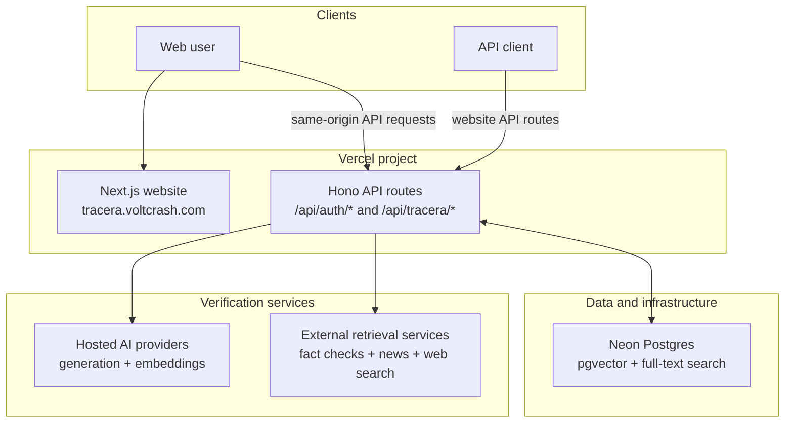

# Tracera

## Purpose

Tracera combats misinformation by evaluating text, links, images, and news sources against reputable evidence. It decomposes a story into atomic claims, traces each claim toward its earliest known source ("Ground Zero"), and reports claim-level verdicts alongside evidence quality and a multi-dimensional Tracera Score.

Tracera also preserves verified claims for deduplication, related-context retrieval, score re-evaluation, and timelines that show how a story's credibility changes as new evidence appears.

## Features

- **Multi-format analysis:** Check news presented as text, links, or images through one verification flow.
- **Claim decomposition:** Break a story into atomic, individually verifiable factual claims instead of judging the article as a whole.
- **Ground Zero tracing:** Identify and surface the earliest known source of a story or claim.
- **Evidence-backed verdicts:** Cross-check each claim against reputable sources and distinguish supporting, conflicting, and inconclusive evidence.
- **Evidence-quality confidence:** Show how strong, recent, and complete the available evidence is separately from the claim verdict.
- **Tracera Score:** Summarize source reputation, factual skew, manipulative language, recency, and cross-source corroboration in a transparent rating.
- **Trace timelines:** Track previous checks, reappearances, and score changes as a story develops.
- **Verified claims corpus:** Reuse prior analysis for deduplication and related context.

## Stack

- **Toolchain and monorepo:** Vite+ (`vp`), pnpm, TypeScript
- **Website:** Next.js with Hono API routes
- **Data:** Neon Postgres, pgvector, PostgreSQL full-text search, Drizzle ORM
- **Hosting:** One Vercel project serving the website and its server routes
- **Authentication:** Better Auth with Google OAuth, Drizzle, and Neon Postgres
- **AI:** Provider-neutral generation and embedding adapters for Gemini, OpenAI, OpenRouter, Anthropic, and OpenAI-compatible APIs

## Development

Install dependencies and run the static checks and tests with Vite+:

```sh
vp install
vp check
vp test --run
```

The website uses the Next.js CLI, so its workspace commands run through Vite Task rather than Vite's built-in app commands:

```sh
vp run dev           # Run the website and its API routes
vp run build         # Build the website and workspace packages
```

`vp dev` and `vp build` always invoke Vite's built-in commands. Use `vp run dev` and `vp run build` in this repository so the correct framework command is selected for each application.

## Current deployment architecture

Tracera is deployed as a single Next.js application on Vercel at `tracera.voltcrash.com`. The website serves its pages and mounts the Hono server behind `/api/*`: Better Auth answers at `/api/auth/*`, the first-party analysis routes at `/api/tracera/*`, and the public API at `/api/tracera/v1/*`.

The server connects to Neon Postgres for application data, full-text search, claim embeddings, vector retrieval, and reusable analysis results. Analysis runs on demand: there is no scheduled re-analysis.

Better Auth is mounted at the same-origin path `/api/auth/*`. Its UI is rendered locally, its sessions are stored in the existing Neon Postgres database through Drizzle, and Google is the only enabled identity provider. Browser-facing authentication code and API calls stay on `https://tracera.voltcrash.com`; only the explicit OAuth redirect leaves the site for Google's account flow.

The server calls configured hosted AI providers through a shared abstraction and combines their structured outputs with external retrieval services and Tracera's accumulated claims corpus.


