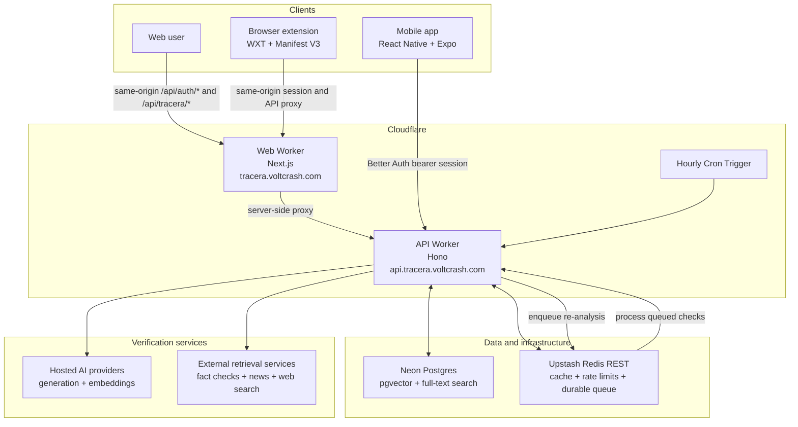

# Tracera

## Purpose

Tracera combats misinformation by evaluating text, links, images, and news sources against reputable evidence. It decomposes a story into atomic claims, traces each claim toward its earliest known source ("Ground Zero"), and reports claim-level verdicts alongside evidence quality and a multi-dimensional Tracera Score.

Tracera also preserves verified claims for deduplication, related-context retrieval, score re-evaluation, and timelines that show how a story's credibility changes as new evidence appears.

## Features

- **Multi-format analysis:** Check news presented as text, links, or images through one verification flow.
- **Claim decomposition:** Break a story into atomic, individually verifiable factual claims instead of judging the article as a whole.
- **Ground Zero tracing:** Identify and surface the earliest known source of a story or claim.
- **Evidence-backed verdicts:** Cross-check each claim against reputable sources and distinguish supporting, conflicting, and inconclusive evidence.
- **Evidence-quality confidence:** Show how strong, recent, and complete the available evidence is separately from the claim verdict.
- **Tracera Score:** Summarize source reputation, factual skew, manipulative language, recency, and cross-source corroboration in a transparent rating.
- **Trace timelines:** Track previous checks, reappearances, and score changes as a story develops.
- **Personal history:** Give each account a private record of every story it has checked, including traces served from a recent identical check.
- **Verified claims corpus:** Reuse prior analysis for deduplication and related context while periodically re-checking claims as evidence changes.

## Stack

- **Toolchain and monorepo:** Vite+ (`vp`), pnpm, TypeScript
- **Web:** Next.js
- **Mobile:** React Native, Expo
- **Browser extension:** WXT, Manifest V3
- **API:** Hono
- **Data:** Neon Postgres, pgvector, PostgreSQL full-text search, Drizzle ORM
- **Cache and durable work queue:** Upstash Redis REST
- **Authentication:** Better Auth with Google OAuth, Drizzle, and Neon Postgres
- **AI:** Provider-neutral generation and embedding adapters for Gemini, OpenAI, OpenRouter, Anthropic, and OpenAI-compatible APIs

## Development

Install dependencies and run the static checks and tests with Vite+:

```sh
vp install
vp check
vp test --run
```

The applications use framework CLIs (Next.js, Wrangler, Expo, and WXT), so their workspace commands run through Vite Task rather than Vite's built-in app commands:

```sh
vp run dev          # API and web development servers
vp run dev:mobile   # Expo development server
vp run build        # Build every workspace application
vp run deploy:api
vp run deploy:web
```

`vp dev` and `vp build` always invoke Vite's built-in commands. Use `vp run dev` and `vp run build` in this repository so the correct framework command is selected for each application.

## Current deployment architecture

The Next.js web application and Hono API are deployed as separate Cloudflare Workers. The web Worker serves the product at `tracera.voltcrash.com`. Browser and extension requests use the first-party `/api/tracera/*` proxy on that origin; the proxy communicates with the API Worker at `api.tracera.voltcrash.com` server-side. The mobile app communicates with the API Worker directly.

The API Worker connects to Neon Postgres for application data, full-text search, claim embeddings, and vector retrieval. Upstash Redis provides REST-based caching, API rate limits, and the durable ready/processing/dead-letter queue used for decay monitoring. An hourly Cloudflare Cron Trigger schedules re-analysis work, and the Worker processes queued checks without relying on a persistent server process.

Better Auth is mounted by the web Worker at the same-origin path `/api/auth/*`. Its UI is rendered locally, its sessions are stored in the existing Neon Postgres database through Drizzle, and Google is the only enabled identity provider. Browser-facing authentication code and API calls stay on `https://tracera.voltcrash.com`; only the explicit OAuth redirect leaves the site for Google's account flow. The API Worker validates the same Better Auth session for authenticated web, mobile, and extension requests.

The API calls configured hosted AI providers through a shared abstraction and combines their structured outputs with external retrieval services and Tracera's accumulated claims corpus.


