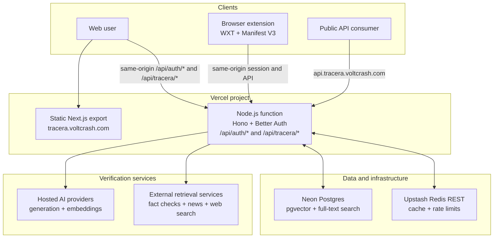

# Tracera

## Purpose

Tracera combats misinformation by evaluating text, links, images, and news sources against reputable evidence. It decomposes a story into atomic claims, traces each claim toward its earliest known source ("Ground Zero"), and reports claim-level verdicts alongside evidence quality and a multi-dimensional Tracera Score.

Tracera also preserves verified claims for deduplication, related-context retrieval, score re-evaluation, and timelines that show how a story's credibility changes as new evidence appears.

## Features

- **Multi-format analysis:** Check news presented as text, links, or images through one verification flow.
- **Claim decomposition:** Break a story into atomic, individually verifiable factual claims instead of judging the article as a whole.
- **Ground Zero tracing:** Identify and surface the earliest known source of a story or claim.
- **Evidence-backed verdicts:** Cross-check each claim against reputable sources and distinguish supporting, conflicting, and inconclusive evidence.
- **Evidence-quality confidence:** Show how strong, recent, and complete the available evidence is separately from the claim verdict.
- **Tracera Score:** Summarize source reputation, factual skew, manipulative language, recency, and cross-source corroboration in a transparent rating.
- **Trace timelines:** Track previous checks, reappearances, and score changes as a story develops.
- **Verified claims corpus:** Reuse prior analysis for deduplication and related context.

## Stack

- **Toolchain and monorepo:** Vite+ (`vp`), pnpm, TypeScript
- **Web:** Next.js
- **Browser extension:** WXT, Manifest V3
- **API:** Hono
- **Data:** Neon Postgres, pgvector, PostgreSQL full-text search, Drizzle ORM
- **Cache and rate limits:** Upstash Redis REST
- **Hosting:** One Vercel project (static export plus a bundled Node.js function)
- **Authentication:** Better Auth with Google OAuth, Drizzle, and Neon Postgres
- **AI:** Provider-neutral generation and embedding adapters for Gemini, OpenAI, OpenRouter, Anthropic, and OpenAI-compatible APIs

## Development

Install dependencies and run the static checks and tests with Vite+:

```sh
vp install
vp check
vp test --run
```

The applications use framework CLIs (Next.js and WXT), so their workspace commands run through Vite Task rather than Vite's built-in app commands:

```sh
vp run dev           # Hono server and Next.js development servers
vp run build         # Build every workspace application
vp run build:vercel  # Produce the Vercel deployment output
```

`vp dev` and `vp build` always invoke Vite's built-in commands. Use `vp run dev` and `vp run build` in this repository so the correct framework command is selected for each application.

## Current deployment architecture

Tracera is deployed as a single Vercel project. The Next.js application is a static export served from Vercel's edge network at `tracera.voltcrash.com`, and one bundled Node.js function hosts the Hono server behind every `/api/*` path. Browser and extension requests therefore stay same-origin: Better Auth answers at `/api/auth/*` and the application API at `/api/tracera/*`. The public API keeps its own hostname, `api.tracera.voltcrash.com`, which routes to the same function with the shared prefix restored.

The build produces the [Vercel Build Output API](https://vercel.com/docs/build-output-api/v3) directory in `.vercel/output`: `vp run build:vercel` exports the web application, bundles the server into a single file with `vp pack`, and writes the routing configuration.

The server connects to Neon Postgres for application data, full-text search, claim embeddings, and vector retrieval. Upstash Redis provides REST-based caching and API rate limits. Analysis runs on demand: there is no scheduled re-analysis.

Better Auth is mounted at the same-origin path `/api/auth/*`. Its UI is rendered locally, its sessions are stored in the existing Neon Postgres database through Drizzle, and Google is the only enabled identity provider. Browser-facing authentication code and API calls stay on `https://tracera.voltcrash.com`; only the explicit OAuth redirect leaves the site for Google's account flow. The same Better Auth session authorizes authenticated web and extension requests.

The server calls configured hosted AI providers through a shared abstraction and combines their structured outputs with external retrieval services and Tracera's accumulated claims corpus.


