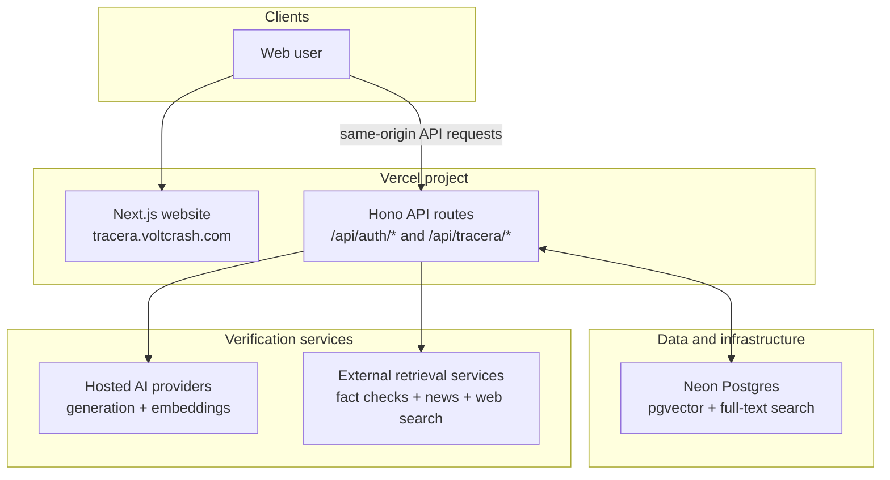

# Tracera

## Purpose

Tracera evaluates pasted text, public links, and screenshots against evidence it can name. It selects up to three checkable factual claims, reports each claim's verdict with exact evidence, and shows a scoped supported share only when the resolved evidence is sufficient.

Tracera also preserves report artifacts, related context, and immutable timelines of observed timestamps as new evidence appears.

Analysis is part of Tracera's main product flow. Older evaluation, calibration, staging, and
worker documents remain in `docs/core-overhaul/` as archived historical artifacts; they are not
claims about current accuracy or readiness.

## Features

- **Multi-format analysis:** Check news presented as text, links, or images through one verification flow.
- **Claim decomposition:** Break a story into atomic, individually verifiable factual claims instead of judging the article as a whole.
- **Scoped provenance:** Show earliest-observed source signals within the searched scope, with unknown history left unresolved.
- **Evidence-backed verdicts:** Cross-check each selected claim against applicable evidence and distinguish supporting, conflicting, and inconclusive states.
- **Evidence status:** Show evidence strength, applicability, independence, recency, and completeness separately from the claim verdict when those records exist.
- **Factual score:** Report the supported share of resolved selected claims only; source context, framing, provenance, and recency never become factual truth points.
- **Trace timelines:** Show immutable published, updated, event, indexed, archived, and captured observations with unknown times left unresolved.
- **Related context:** Similar stories remain context and do not stand in for evidence about the submitted claim.

## Stack

- **Toolchain and monorepo:** Vite+ (`vp`), pnpm, TypeScript
- **Website:** Next.js with Hono API routes
- **Data:** Neon Postgres, pgvector, PostgreSQL full-text search, Drizzle ORM
- **Hosting:** One Vercel project serving the website and its server routes
- **Authentication:** Better Auth with Google and GitHub, Drizzle, and Neon Postgres
- **AI:** Provider-neutral generation and embedding adapters for Gemini, OpenAI, OpenRouter, Anthropic, and OpenAI-compatible APIs

## Development

Install dependencies and run the static checks and tests with Vite+:

```sh
vp install
vp check
vp test --run
```

Generate isolated local/test configuration for this worktree. Root `.env`
files are rejected and never loaded:

```sh
vp run env:setup
vp run env:diagnose:local
```

Profiles, process roles, deployed examples, and the safe migration away from a
shared root `.env` are documented in [docs/environment.md](docs/environment.md).

Start this worktree's PostgreSQL (Docker-compatible engine required) and apply
migrations before running the server:

```sh
vp run db:local:start
vp run db:local:migrate
```

Local sign-in uses generated development identities. Analysis evaluation is available
through deterministic fixtures; interactive analysis requires deployed live-provider settings.

The website uses the Next.js CLI, so its workspace commands run through Vite Task rather than Vite's built-in app commands:

```sh
vp run dev           # Run the website and its API routes
vp run build         # Build the website and workspace packages
```

`vp dev` and `vp build` always invoke Vite's built-in commands. Use `vp run dev` and `vp run build` in this repository so the correct framework command is selected for each application.

## Current deployment architecture

Tracera is deployed as a single Next.js application on Vercel at `tracera.voltcrash.com`. The website serves its pages and mounts the Hono server behind `/api/*`: Better Auth answers at `/api/auth/*` and the first-party application routes at `/api/tracera/*`.

The server connects to Neon Postgres for application data, full-text search, claim embeddings, vector retrieval, and reusable analysis results. Analysis runs on demand: there is no scheduled re-analysis.

Better Auth is mounted at the same-origin path `/api/auth/*`. Its UI is rendered locally, its sessions are stored in the existing Neon Postgres database through Drizzle, and Google and GitHub are enabled identity providers. Browser-facing authentication code and API calls stay on `https://tracera.voltcrash.com`; only the explicit authorization redirects leave the site for the providers' account flows.

The server calls configured hosted AI providers through a shared abstraction and combines their structured outputs with external retrieval services and Tracera's accumulated claims corpus.


